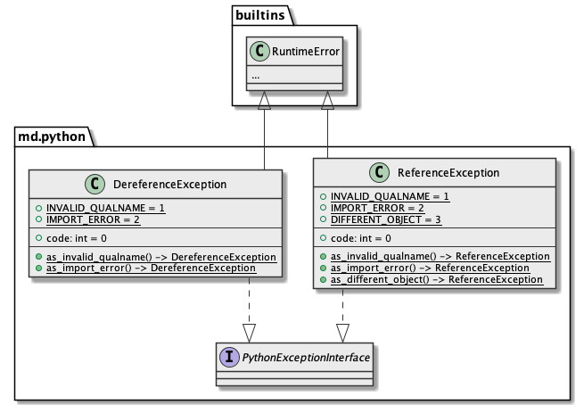

# md.python

md.python is a component that provides python definition API.

## Architecture overview



## Component overview

```python3
def dereference(reference_: str) -> type: ...
def reference(definition: typing.Union[str, collections.Callable], explicit: bool = True) -> str: ...
def verify_reference(reference_: str, source: object) -> None: ...
```

## Install

```sh
pip install md.python --index-url https://source.md.land/python/
```

## Documentation
### Reference a definition

```python3
def reference(id_: typing.Union[str, collections.Callable], explicit: bool = True) -> str
```

`md.python.reference` function returns string reference (path to get definition) 
for given identifier (definition). Mostly required for persistence things (to dump/load 
configuration to restore related states), rarely to keep references consolidated.

When identifier type is a string, given value will be returned without change, 
but with validation.

Some definitions may be imported from private internal module (
e.g. `md.python.reference` imported from `md.python._python.reference`),
for such cases to resolve definition reference implicitly 
(to get designed public API) `explicit=False` parameter should be provided.

#### Example

```python3
import md.python

md.python.reference(definition='os.error')  # 'os.error'
md.python.reference(definition=str)  # 'builtins.str'
md.python.reference(definition=str, explicit=False)  # 'str'
md.python.reference(definition=md.python.reference)  # 'md.python._python.reference'
md.python.reference(definition=md.python.reference, explicit=False)  # 'md.python.reference'
```

### Reference verification

```python3
def verify_reference(reference_: str, source: object) -> None
```

To ensure that reference taken correct `md.python.verify_reference` should be used.

#### Example

```python3
import md.python

md.python.verify_reference('md.python._python.reference', md.python._python.reference)  # (nothing, ok)
md.python.verify_reference('md.python.reference', md.python._python.reference)  # (nothing, ok)
md.python.verify_reference('md.python.reference', md.python.dereference)  # raises an ReferenceException
```

### Dereference a reference

```python3
def dereference(reference_: str) -> object
```

`md.python.dereference` function returns definition 
by string reference (path to get definition). 

#### Example

```python3
import md.python

md.python.dereference(reference_='md.python.dereference')  # <function reference at 0x7fae50d8dc10>
md.python.dereference(reference_='md.python._python.dereference')  # <function reference at 0x7fae50d8dc10>
```
